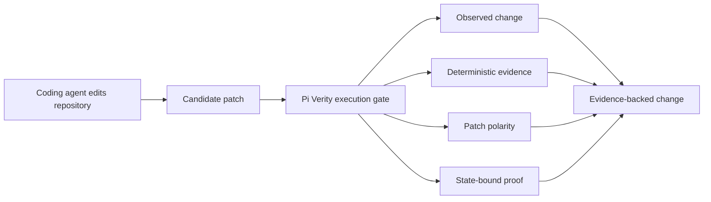

# pi-verity

**Pi Verity turns agent patches into evidence-backed changes.**

A model-agnostic execution gate for coding agents that independently proves:

- what actually changed,
- whether the evidence depends on that patch,
- and whether the proof is still valid.

Your coding agent says "done."
Pi Verity does not ask another model whether it agrees.
It checks the resulting state.

```bash
npm ci
npm run build
node dist/cli.js verify . --output proof-receipt.json
# pi-verity: PASS
```

> **Release status:** pre-release. Local and Git-package evaluation are supported. The repository is currently private, the npm package `@pauleschwarz/pi-verity` is configured but not published, and nothing here publishes automatically.

## The three questions

### 1. What actually changed?

Pi Verity does not trust a textual completion claim. It binds verification to the observed Git state, the actual changed files, a baseline identity, and the final repository-state hash.

### 2. Does the evidence depend on that change?

When tests change and an exact baseline workspace is available, Pi Verity checks patch polarity:

```text
candidate test + baseline implementation  -> FAIL (RED)
candidate test + candidate implementation -> PASS (GREEN)
```

If the candidate test passes against both implementations, it is non-discriminating evidence—not strong proof of the patch.

### 3. Is the proof still valid?

A successful proof receipt is bound to the candidate repository state. If relevant state changes afterward, the Pi adapter reports:

```text
PASS -> STALE
```

A receipt for an earlier patch is not proof for a later one.

## Why an execution gate?

A coding agent can produce a wrong implementation, weaken the test that should catch it, and still report a green suite. Asking another model for an opinion does not create independent evidence.

Pi Verity instead observes the repository, selects conservative deterministic checks, records scope-integrity signals, evaluates counterfactual evidence where applicable, and emits a state-bound `ProofReceipt`.

> **The model may produce the change. It does not certify the change.**

Weak agents are not made smarter. Unsupported completions are made harder to pass.

## Pi usage

Install from a reviewed local checkout:

```bash
npm ci
npm run verify
pi install /absolute/path/to/pi-verity
```

Then use the Verity gate in Pi:

```text
/verity          show the current concise verdict
/verity run      execute verification now
/verity why      explain every selected check and emitted signal
/verity receipt  show the persisted receipt path and canonical JSON
```

Successful automatic runs remain quiet. Warnings and failures are bounded:

```text
pi-verity ✓ 4 checks · 1.8s · proof: PASS

pi-verity ⚠ PASS_WITH_WARNINGS
dependency added · counterfactual proof unavailable
/verity why

pi-verity ✗ FAIL
targeted test failed
/verity why
```

Receipts are written with mode `0600` where supported under:

```text
~/.pi/agent/pi-verity/receipts/<repository-hash>/
```

## CLI

```bash
pi-verity verify [repository] \
  [--output receipt.json] \
  [--timeout-ms N] \
  [--max-output-bytes N]
```

The CLI exits `0` for `PASS` and `PASS_WITH_WARNINGS`, `1` for `FAIL`, and `2` for `UNPROVEN` or invalid usage.

After a tagged GitHub release exists:

```bash
pi install git:github.com/pauleschwarz/pi-verity@v0.1.0
```

After a separate, explicit npm publication:

```bash
pi install npm:@pauleschwarz/pi-verity@0.1.0
npx @pauleschwarz/pi-verity verify . --output proof-receipt.json
```

## Verdicts

- `PASS` — selected deterministic evidence passed.
- `PASS_WITH_WARNINGS` — selected evidence passed, but bounded warnings remain.
- `FAIL` — deterministic evidence failed.
- `UNPROVEN` — required evidence was unavailable, cancelled, timed out, or inconclusive.

Pi Verity does not turn uncertainty into `PASS` and does not infer correctness from patch size.

## Deterministic evidence

The zero-config gate selects at most one conservative repository command:

- Node: first available script from `test`, `verify`, `check`, `typecheck`, or `lint`, using the detected lockfile runner.
- Python: `python3 -m pytest` only when pytest is configured in `pyproject.toml`.
- Rust: `cargo test`.
- Go: `go test ./...`.

Potentially destructive Node scripts are refused. Dependencies are never installed by Pi Verity. A clean, unchanged repository does not run an unnecessary command.

Current adapter configuration is environment-based:

| Variable | Default | Meaning |
| --- | ---: | --- |
| `PI_VERITY_MAX_REPAIR_ATTEMPTS` | `2` | Automatic same-agent follow-ups after deterministic `FAIL`; integer `0..10`, where `0` disables them. |
| `PI_VERITY_ALLOW_COUNTERFACTUAL_NETWORK` | unset | Set to `1` to allow network during counterfactual runs. |

Repository configuration discovery is not shipped in `0.1.0`; `.pi-verity.yml` is reserved as the canonical future filename and is not silently accepted today. See [Configuration](docs/CONFIGURATION.md).

## Architecture

```text
@pauleschwarz/pi-verity (core export)
    independent proof semantics

@pauleschwarz/pi-verity/adapter-pi
    thin Pi adapter

pi-verity
    optional direct CLI
```

The source has three runtime surfaces:

- `src/core/` — deterministic verification, isolation, policy, and receipt generation.
- `src/adapter-pi/` — thin Pi lifecycle and command integration.
- `src/cli.ts` — optional direct CLI.

The core imports no Pi, agent-core, model, provider, or LLM SDK and makes no LLM calls. Provider/model identity is not proof input. There is no daemon, database, model router, critic agent, or hidden service.



## Security boundaries

- No hidden telemetry, analytics identifier, provider call, or product network call.
- No automatic package installation.
- Repository verification commands are trusted repository code and may use the user's privileges and network.
- Counterfactual execution denies network on supported macOS environments unless explicitly allowed; unsupported platforms report that isolation is unavailable.
- Command duration, captured output, workspace size, analyzed files, and evidence are bounded.
- Candidate execution occurs in disposable copies, not the original worktree.
- Proof receipts can contain paths and repository-produced output; treat them as sensitive.

Pi Verity is an execution gate, not an OS sandbox and not a complete proof of semantic correctness. See [Threat Model](docs/THREAT_MODEL.md) and [Limitations](docs/LIMITATIONS.md).

## Documentation

- [Architecture](docs/ARCHITECTURE.md)
- [Proof model](docs/PROOF_MODEL.md)
- [Counterfactual verification](docs/COUNTERFACTUAL_VERIFICATION.md)
- [Design principles](docs/DESIGN_PRINCIPLES.md)
- [Configuration](docs/CONFIGURATION.md)
- [Adapters](docs/ADAPTERS.md)
- [Threat model](docs/THREAT_MODEL.md)
- [Limitations](docs/LIMITATIONS.md)
- [FAQ](docs/FAQ.md)
- [Release readiness](docs/RELEASE_READINESS.md)

## Development

```bash
npm ci
npm run typecheck
npm run lint
npm run test:unit
npm run test:integration
npm run build
npm pack --dry-run
```

Contributions are covered by [CONTRIBUTING.md](CONTRIBUTING.md). Releases follow [RELEASING.md](RELEASING.md). Nothing is published automatically.
