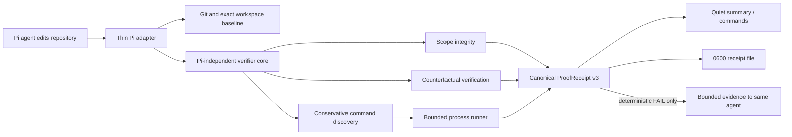

# pi-proof

> **Proof-carrying patches for coding agents.**

`pi-proof` is a deterministic, model-independent verification layer for Pi that turns repository changes into bounded, inspectable proof receipts.

> **Release status:** pre-release. Local and Git package installation are supported for evaluation. The npm package is configured as `@pauleschwarz/pi-proof` but has not been published. Nothing in this repository publishes automatically.

## Problem

A coding agent can produce a wrong implementation, weaken or replace the test that should catch it, and still report a green suite. The model that wrote a patch is not an independent authority on whether that patch is correct.

`pi-proof` observes repository state, selects conservative existing checks, records deterministic scope-integrity signals, and emits a structured `ProofReceipt` with one of four verdicts:

- `PASS` — selected evidence passed.
- `PASS_WITH_WARNINGS` — selected evidence passed, but bounded warnings remain.
- `FAIL` — deterministic evidence failed.
- `UNPROVEN` — required evidence was unavailable, cancelled, timed out, or inconclusive.

## Why green tests are insufficient

A test can pass for the wrong reason. It can pass both before and after a patch, skip the failing path, lose an assertion, or be accompanied by an unrelated risky change. `pi-proof` therefore combines command results with baseline identity, counterfactual evidence, anti-gaming checks, and scope-integrity signals. It never treats patch size alone as failure and never claims a change was unnecessary unless that has actually been proven.

## Counterfactual verification

When test files change and an exact baseline workspace is available, `pi-proof` runs the candidate test against both implementations:

```text
candidate test + baseline implementation  -> should fail (RED)
candidate test + candidate implementation -> should pass (GREEN)
```

A test that passes on both sides is reported as non-discriminating rather than accepted as proof. Runs are bounded, use disposable workspace copies, and do not reset, stash, or clean the original working tree.

## Model independence

The verification core imports no Pi, model, provider, or LLM SDK and makes no LLM calls. A receipt is derived from repository state and command results, so changing the executing model or provider does not change proof semantics for the same workspace and configuration.

On deterministic failure, the Pi adapter sends only bounded failure evidence back to the **same** session agent. It never spawns a critic or repair agent. Automatic repair follow-ups default to two consecutive attempts; after the limit, evidence is queued without triggering another turn.

## Pi integration

The package exposes one thin Pi extension through `package.json` and supports:

```text
/proof          show the current concise verdict
/proof run      execute verification now
/proof why      explain every selected check and emitted signal
/proof receipt  show the persisted receipt path and canonical JSON
```

Automatic verification runs only after repository-changing tools were observed. Successful automatic runs remain quiet. Warnings and failures use bounded summaries such as:

```text
pi-proof ✓ 4 checks · 1.8s · proof: PASS

pi-proof ⚠ PASS_WITH_WARNINGS
dependency added · counterfactual proof unavailable
/proof why

pi-proof ✗ FAIL
targeted test failed
/proof why
```

Receipts are persisted with mode `0600` under:

```text
~/.pi/agent/pi-proof/receipts/<repository-hash>/
```

## Architecture



There are only three runtime surfaces:

- `src/core/` — deterministic verification, isolation, policy, and receipt generation.
- `src/adapter-pi/` — Pi lifecycle and command integration.
- `src/cli.ts` — optional `pi-proof verify` CLI.

No daemon, service, database, model router, or secondary agent is introduced.

## Installation

Review the source first: Pi extensions execute with the user's privileges.

### Local evaluation

```bash
npm ci
npm run verify
pi install /absolute/path/to/pi-proof
```

### Git package

After this repository is pushed to GitHub and tagged:

```bash
pi install git:github.com/pauleschwarz/pi-proof@v0.1.0
# or, for a one-run evaluation:
pi -e git:github.com/pauleschwarz/pi-proof@v0.1.0
```

Pi clones the repository and runs `npm install`; the `prepare` script builds `dist/`.

### npm package

The manifest and lockfile use the currently unclaimed scoped name `@pauleschwarz/pi-proof`. After the manual release gates pass and the package is explicitly published, install it with:

```bash
pi install npm:@pauleschwarz/pi-proof@0.1.0
```

The unscoped npm name `pi-proof` is a different package maintained by `kreek`; the GitHub repository name is unaffected by that registry-level collision.

## Zero-config behavior

For a changed repository, at most one conservative command is selected:

- Node: first available script from `test`, `verify`, `check`, `typecheck`, `lint`, using the detected lockfile runner.
- Python: `python3 -m pytest` only when pytest is configured in `pyproject.toml`.
- Rust: `cargo test`.
- Go: `go test ./...`.

Potentially destructive Node scripts are refused. Dependencies are never installed by `pi-proof`. A clean unchanged repository does not run an unnecessary command.

## Configuration

The shipped configuration surface is intentionally small and environment-based:

| Variable | Default | Meaning |
| --- | ---: | --- |
| `PI_PROOF_MAX_REPAIR_ATTEMPTS` | `2` | Automatic same-agent follow-ups after deterministic `FAIL`; integer `0..10` (`0` disables). Invalid values fall back to `2`. |
| `PI_PROOF_ALLOW_COUNTERFACTUAL_NETWORK` | unset | Set to `1` to allow network during counterfactual runs. Otherwise macOS counterfactual runs deny network when the platform mechanism is available. |

CLI limits are explicit flags:

```bash
pi-proof verify [repository] \
  [--output receipt.json] \
  [--timeout-ms N] \
  [--max-output-bytes N]
```

There is currently **no** `.pi-proof.yml` parser. Unknown repository configuration is not silently accepted. See [Configuration](docs/CONFIGURATION.md).

## Examples

Run verification and write a receipt:

```bash
npx @pauleschwarz/pi-proof verify . --output proof-receipt.json
```

Inspect a warning in Pi:

```text
/proof
/proof why
/proof receipt
```

The CLI exits `0` for `PASS` and `PASS_WITH_WARNINGS`, `1` for `FAIL`, and `2` for `UNPROVEN` or usage errors.

## Security model

- No hidden telemetry and no analytics identifiers.
- No LLM/provider calls.
- No automatic package installation.
- No product network calls. Repository verification commands remain trusted repository code and may use the network.
- Counterfactual network denial is enforced on macOS unless explicitly allowed; other platforms report the policy as unavailable rather than claiming isolation.
- Command duration, captured output, workspace size, analyzed files, and evidence are bounded.
- Candidate execution occurs in disposable copies, not the original worktree.
- Receipt writes are limited to the documented Pi receipt directory; the CLI writes elsewhere only when `--output` is supplied. Temporary copies use the OS temporary directory and are cleaned up.
- Secret-like files are detected by path without emitting their contents. Command output can still contain repository-produced secrets and should be handled as sensitive evidence.

Repository scripts execute with the user's privileges inside a filesystem copy; this is not a complete OS sandbox. Read [Threat Model](docs/THREAT_MODEL.md) and [Security Policy](SECURITY.md) before deployment.

## Limitations

- Proof covers selected deterministic checks, not full semantic correctness.
- Zero-config discovery runs at most one standard command.
- Runtime/UI behavior is not inferred unless an existing selected command exercises it.
- Counterfactual proof requires a portable test and an exact baseline workspace.
- Network isolation is currently platform-dependent.
- Binary and generated-file signals identify changed surfaces; they do not prove necessity.
- Receipt schema v3 is pre-release and may change before 1.0.
- The scoped npm package has not yet been published; npm installation is unavailable until the manual release completes.

See [Limitations](docs/LIMITATIONS.md), [Proof Model](docs/PROOF_MODEL.md), and [Release Readiness](docs/RELEASE_READINESS.md).

## Development

```bash
npm ci
npm run typecheck
npm run lint
npm run test:unit
npm run test:integration
npm run build
npm pack --dry-run
```

Contributions are covered by [CONTRIBUTING.md](CONTRIBUTING.md). Releases follow [RELEASING.md](RELEASING.md). Nothing is published automatically.
