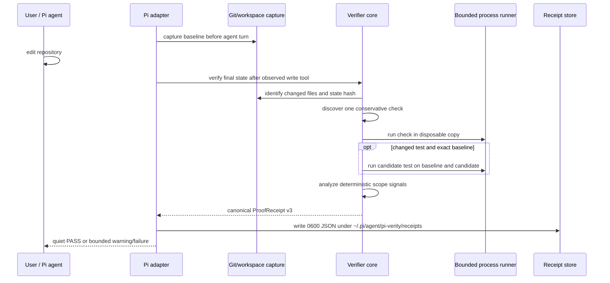

# Architecture

Pi Verity is a model-agnostic execution gate for coding agents. Its architecture separates independent proof semantics from host integration without introducing another model as reviewer or judge.

## Boundary

`pi-verity` is one npm package with three runtime surfaces:

```text
src/core/        deterministic verifier, no Pi or LLM dependency
src/adapter-pi/  thin lifecycle/command adapter
src/cli.ts       optional command-line entry point
```

It has no daemon, server, database, secondary agent, provider adapter, or telemetry pipeline.

## Data flow



## Core

The core owns:

- Git root and snapshot capture
- stable state/diff hashing
- conservative verification-command discovery
- bounded process execution and output capture
- disposable workspace copies
- counterfactual classification
- deterministic anti-gaming and scope-integrity signals
- verdict calculation
- canonical receipt serialization

The core accepts data and options. It does not inspect the selected model, call a provider, send network requests, or write Pi session state.

## Pi adapter

The adapter uses current public Pi extension APIs to:

- capture an exact workspace baseline at `before_agent_start`
- observe repository-capable tools (`write`, `edit`, `bash`, `apply_patch`)
- verify at `agent_settled` only when such a tool was observed
- register `/verity`, `/verity run`, `/verity why`, and `/verity receipt`
- persist receipt metadata in the Pi session
- persist canonical receipt JSON under the documented receipt directory
- return bounded deterministic failure evidence to the same session agent

A consecutive failure counter bounds automatic follow-ups. It defaults to two and never spawns another agent.

## CLI

The CLI calls the same core verifier:

```text
pi-verity verify [repository] [--output FILE] [--timeout-ms N] [--max-output-bytes N]
```

Exit codes are `0` for passing verdicts, `1` for `FAIL`, and `2` for `UNPROVEN` or invalid usage.

## Verification plan

Zero-config discovery selects at most one standard command. This is intentionally narrower than a full CI matrix. If changed tests and an exact baseline are available, counterfactual execution adds a second evidence dimension. Scope integrity always reports whether its baseline was available and why each signal fired.

The verifier does not infer that a dependency, migration, generated file, binary, or broad patch was unnecessary. It reports observed facts and bounded evidence.

## State identity and staleness

`ProofReceipt.final_diff_hash` is the final Git state hash. `/verity` compares it with a fresh snapshot before presenting a current verdict. A mismatch is shown as `STALE` and requires `/verity run`.

## Storage and writes

- Exact baselines and execution copies use the OS temporary directory and are cleaned up.
- The Pi adapter writes receipts only under `~/.pi/agent/pi-verity/receipts/`.
- The CLI writes outside the repository only when the user supplies `--output`.
- Verification commands execute in disposable repository copies and can write within those copies.

## Dependency boundary

The only runtime dependency is `smol-toml`, used for conservative Python project discovery. Pi itself is not a runtime dependency of the core package. TypeScript, `tsx`, and Biome are development-only.

## Non-goals

The current architecture does not provide:

- remote proof services
- policy/configuration plugins
- a `.pi-verity.yml` parser
- runtime browser/UI orchestration
- provider-specific semantics
- cryptographic signatures or remote attestation
